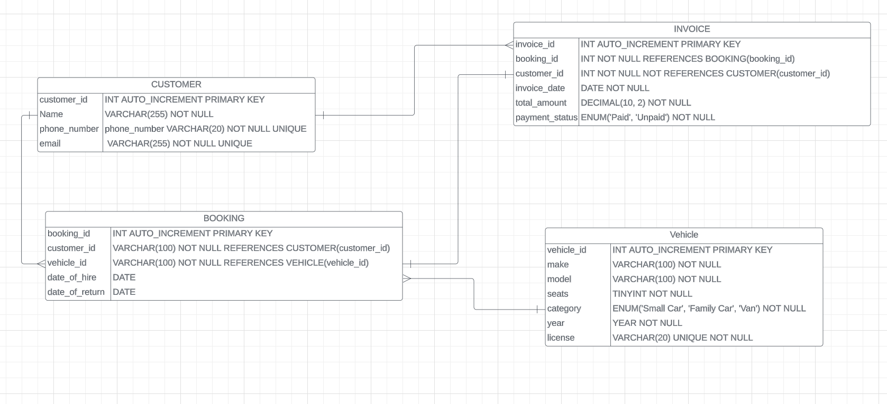

# CAR HIRE MANAGEMENT SYSTEM

## ENTITY RELATIONSIP DIAGRAM AND SQL QUERIES:

1. Navigate to `queries/` to view SQL queries for Entity RELATIONSHIP Diagram

2. View `CAR HIRE MANAGEMENT SYSTEM ENTITY RELATIONSHIP DIAGRAM` Below with cardinality reasoning

- **Cardinality Reasoning**
  - `CUSTOMER TO BOOKING` - A Customer can make multiple bookings and bookings in advance and therefore the cardinality is One-To-Many
  - `VEHICLE TO BOOKING` - Because a customer can book a vehicle up to 7 days in advance, there can be multiple bookings for a vehicle even if it is not available currently but will be within 7 days.
  - `BOOKING TO INVOICE` - Each booking relates to an invoice for that booking as the customer can make multiple bookings and have multiple invoices
  - `CUSTOMER TO INVOICE` - A Customer can have multiple invoices as invoices have a one-to-one relationship to Bookings and therefore each invoice can be generated for a customer



## FLASK API

### File Structure

- `docker` - consists of docker compose file to deploy. See [Deploying with Docker Compose Section](#option-3-docker-compose)

- `queries` - consists of relavent queries seperated by table

- `postman` - consists of json export of car hire management system collection

- `src` - consists of primary source code
  - `database` - consists of database related abstract and concrete classes
    - `database_manager.py` - Abstract Class that contains abstract methods to execute queries
    - `database_connection.py` - Abstract Class that contiains abstract methods for database connectivity
    - `mysql_database_connection.py` - Concrete Implementation of MySQL DB connection
    - `mysql_database_manager.py` - Concrete Implementation of MySQL query exection
    - `database.py` - leverages Single Responsiblity Principle and is responsible for creation of database connection and management
- `router` - consits of router files that can be injected into application
  - `customer_router` - CRUD blueprint routes for Creating, Reading, and Updating, and Deleting customers
- `.env.example` - envars needed to deploy application
- `app.py` - initializes flask application and registers router blueprints
- `Dockerfile` - docker file for flask application

### SOLID Principles

1. **Single Responsiblity Principle**

- `database` module resposnsible for provisioning the database connection and database manager
- `router` module is responsible for organizing routes and handling HTTP requests
- `app.py` - responsible for initializing Flask APP and including its dependencies

2. **Open and Closed Princple**

- `routes` module has the capability of adding routes and without interfering with outer routes
- application changes for database and app.py are minimal
  - `database` module will only require additional querying functionality but routes are responsible for the query itself
  - `app.py` - only requires registration of more router blueprints

3. **Liskov Substitiion Principle**

- can create multiple subclasses of `database manager` and `database connection` classes to support multiple database options
- subclasses are compliant with the abstract class and can be replaced in a seamless manner

4. **Interface Segregation Princple**

- Each module consists of code such as abstract classes and concrete classes that they require

5. **Dependency Inversion Principle**

- code is dependent on abstractions such as Blueprints and database manager and connection abstract classes
- `routers` depend on abstract database manager but does not require the implementation details
- Can create additional implementation of various databases as long as they follow the abstract classes
- routes can be passed in to `app.py` by specifying its blueprints and can be switched out as `app.py` does not need to know implementation details

## How To Deploy

### Option 1

#### Start up MySQL

1. Run the mysql container

- `docker run --name mysql-server --publish 127.0.0.1:3307:3306 -e MYSQL_ROOT_PASSWORD=password123 -e MYSQL_PASSWORD=password123 -d mysql:latest`
  - substutite `127.0.0.1` with your host

2. Exec into container

- `docker exec -it mysql-server mysql -u root -p`

#### Start up PHP My Admin to access database via GUI

1. Run the phpmyadmin and link mysql-server container
   `docker run --name phpmyadmin -d --link mysql-server:db -p 8080:80 phpmyadmin/phpmyadmin`

2. Navigate to phpmyadmin by going to `localhost:8080`

3. Login using mysql credentials

4. create new database

- `DROP DATABASE IF_EXISTS CAR_HIRE_MANAGEMENT;`
- `CREATE DATABASE CAR_HIRE_MANAGEMENT;`

5. Copy contents in directory `queries/CUSTOMER_TABLE.sql`

6. Execute code to create `CUSTOMER` table

#### Set up Application locally

1. Create a virtual environment and activiate it

- `python3 -m venv venv`
- `source venv/bin/activate`

2. Navigate to `src/` directory

3. Copy the contents of .env.example into .env

- `cp .env.example .env`

4. Set the values in your .env files to connect to MySQL

```bash
  MYSQL_HOST=localhost
  MYSQL_USER={root_user} # change if another user is created
  MYSQL_ROOT_PASSWORD={root_password}
  MYSQL_PASSWORD={root_password} # change another user with password is created
  MYSQL_DB=CAR_HIRE_MANAGEMENT # change if another Database name is used
```

5. Install the requirements from `src/requirements.txt`

- `pip install src/requirements.txt`

6. Run the Flask Application

- Options
  - `python app.py`
  - `export FLASK_APP=app.py FLASK_ENV=development FLASK_RUN_PORT=5000 FLASK_RUN_DEBUG=1 && flask run`
    - `FLASK_RUN_DEBUG` and `FLASK_RUN_PORT` are optional

### Option 2 Use Docker Image

#### Start up MySQL

1. Run the mysql container

- `docker run --name mysql-server --publish 127.0.0.1:3307:3306 -e MYSQL_ROOT_PASSWORD=password123 -e MYSQL_PASSWORD=password123 -d mysql:latest`
  - substutite `127.0.0.1` with your host

2. Exec into container

- `docker exec -it mysql-server mysql -u root -p`

2. Navigate to `src/` directory

3. Copy the contents of .env.example into .env

- `cp .env.example .env`

4. Set the values in your .env files to connect to MySQL

```bash
  MYSQL_HOST=host.docker.internal
  MYSQL_USER={root_user} # change if another user is created
  MYSQL_ROOT_PASSWORD={root_password}
  MYSQL_PASSWORD={root_password} # change another user with password is created
  MYSQL_DB=CAR_HIRE_MANAGEMENT # change if another Database name is used
```

#### Start up PHP My Admin to access database via GUI

1. Run the phpmyadmin and link mysql-server container
   `docker run --name phpmyadmin -d --link mysql-server:db -p 8080:80 phpmyadmin/phpmyadmin`

2. Navigate to phpmyadmin by going to `localhost:8080`

3. Login using mysql credentials

4. create new database

- `DROP DATABASE IF EXISTS CAR_HIRE_MANAGEMENT;`
- `CREATE DATABASE CAR_HIRE_MANAGEMENT;`

5. Copy contents in directory `queries/CUSTOMER_TABLE.sql`

6. Execute code to create `CUSTOMER` table

#### Build and Run Docker Image

1. Navigate to `src/` directory
2. build docker image

- `docker build -t car_hire_management:latest .`

3. run docker image

- `docker run -p 5000:5000 -e FLASK_DEBUG=0 abhi94n/car_hire_management:latest`
  - `FLASK_DEBUG=0` - for production using gunicron
  - `FLASK_DEBUG=1` - for debugging and development

### Option 3 Docker Compose

1. Navigate to `docker/` directory

2. Start up docker compose

- `docker compose up`

3. Wait until the init script runs. Completion will look something like below

- `docker-mysql-server-1         | 2023-10-08 04:35:31+00:00 [Note] [Entrypoint]: MySQL init process done. Ready for start up.`

4. Find and restart the `car_hire_management` container in order for it to connect to the database

- list containers
  - `docker ps`
- restart the docker container
  - `docker restart {container_id_or_name}`

5. Stop and remove container

- `docker compose down`
